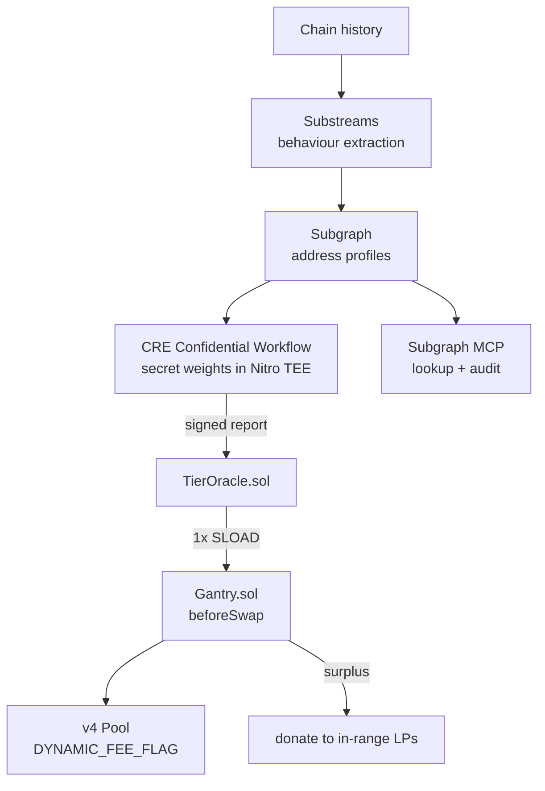

# Gantry

**Every swap gets read as it passes.**

A toll gantry reads a vehicle at full speed, classifies it, and bills it accordingly — without anyone stopping. That is exactly this mechanism: observe, classify by demonstrable behaviour, price differentially, **never impede**.

A Uniswap v4 hook that prices every swap by the swapper's **on-chain behaviour**, with the scoring parameters held inside a TEE so the mechanism can't be gamed. Toxic flow pays a toll. The toll goes to LPs.

ETHOnline 2026 · solo · net-new (Classic / "From Scratch")
**Selections: Uniswap Foundation · The Graph · Chainlink** — 3 selections, 4 tracks, 9 winnable slots

---

## 1. The pitch

> **"Sandwich bots pay the toll. LPs collect it."**

Every MEV mitigation in existence is *infrastructural* — private mempools, batch auctions, order-flow routing. Nobody has attacked it at the **mechanism** layer, inside the pool itself.

The naive version fails immediately: charge bots more, publish the rule, and bots simply size their behaviour to sit under the threshold. **A public rulebook is a rulebook you game.** So the thresholds live in a hardware enclave, and the only thing that reaches the chain is a verdict.

---

## 2. Why this one — the prior-art verdict

Verified in an adversarial scan. **Open gap, uncontested.**

| System | What it does | Why it isn't this |
|---|---|---|
| **Angstrom** (Sorella, Paradigm-backed) | Uniform-clearing-price batch auction + priority-fee MEV tax | Applied **identically to everyone**. No per-address scoring, no TEE. |
| **Arrakis Diamond** | Dynamic fees | Driven by **volatility and inventory**, not behaviour. |
| **Detox-Hook** (ETHGlobal winner) | Taxes oracle-price deviation | **Uniform**, not behavioural. |
| **Nomis / RubyScore / Ethos / Cred** | Wallet reputation scores | General trustworthiness for **lending and airdrops** — never sandwicher-specific behaviour at swap time, and **none hide the model**. |
| arXiv 2512.17602 | Studies bot behavioural adaptation | Academic; not a pricing mechanism. |

**Nobody combines address-level MEV-behaviour scoring with confidential parameters applied at swap time.**

Two things it is explicitly *not*, and both should be said out loud:
- **Not** Uniswap's **Permissioned Pools** (shipped 2026-07-23 with Securitize/Superstate/Dowgo) — that's identity-gated allowlisting. Gantry has no identity, no credential, no allowlist, and blocks nobody.
- **Not** "humans pay less than bots" — that was *Turing Swap* at Lisbon 2026, and World now explicitly bans personhood-based benefits. Gantry reads **behaviour**, never personhood.

---

## 3. The mechanism

### 3.1 What gets measured

Only **public on-chain behaviour**. No identity, no off-chain data.

| Signal | Why it matters |
|---|---|
| **Sandwich-shaped sequences** | Same block, same pool, buy-before + sell-after around a victim tx. **An objective, provable structure — not a judgment call.** |
| Same-block counter-trades | The core sandwich fingerprint |
| Backrun cadence | Time-to-counter-trade distribution |
| Clustering after large pending trades | Targeting behaviour |
| Circular / self-counterparty flow | Wash-trading to farm a good tier |
| Address age + benign volume | The cost of earning a cheap tier |

### 3.2 Tiers

| Tier | Who | Fee (illustrative) |
|---|---|---|
| **T0 Clean** | Accumulated benign history | 5 bp |
| **T1 Unknown** | No history — **the default** | 30 bp |
| **T2 Suspected** | Some extraction signal | 60 bp |
| **T3 Extractor** | Confirmed repeat sandwicher | 100 bp |

**Unknown defaults to T1, not T0.** This is the single most important design decision — see §4.

### 3.3 Where the toll goes

The delta above the base fee is taken via the hook's custom accounting and **donated back to in-range LPs** (`PoolManager.donate()`). Extraction gets recycled to the people being extracted from.

---

## 4. Defence — every hole, and the fix

### 4.1 The five decisions that close most of it

**① Unknown = the *highest* tier, not the lowest.**
Kills address rotation, the deepest objection. A fresh address has no history, so rotation doesn't *escape* the toll — it **guarantees** it. The only path to a cheap tier is accumulated benign history, costing time and real non-extractive volume. Put the break-even on a slide: how much benign volume must a bot push before the discount beats the sandwich?

**② Anti-sandwich, not anti-bot.**
**Arbitrage is good for LPs** — it rebalances the pool. Sandwiching is theft from an identifiable victim. Price only the latter. This defuses the strongest intellectual objection and is why the mechanism is defensible rather than blunt.

**③ Never block. Only price.**
Nobody is ever refused a swap; worst case they pay more. Bounds the harm from misclassification, and is the bright line separating this from Permissioned Pools.

**④ Score asynchronously, cache the tier on-chain.**
Dissolves three holes at once. The enclave never runs per swap — it runs on a cron/log trigger and batch-writes tiers to the consumer contract. The hook does **one `SLOAD`**. CRE's call budget stops mattering, gas overhead becomes negligible, and there's no latency in the swap path.

**⑤ Fail open on availability, closed on price.**
Missing or stale score → default tier. **The hook never reverts.** A reverting hook bricks the pool for everyone — the classic v4 footgun.

### 4.2 The Q&A kill shots

**"Bots will just route around your pool."**
*Say this before they do.* That's a **success condition**. LVR is the single largest cost LPs bear. A pool that repels toxic flow and keeps retail is more profitable for LPs *even at lower volume*. The mechanism wins either way: they pay the toll, or they leave and LPs stop being extracted from.

**"CRE's workflow binary isn't confidential — so the model isn't secret."**
Correct, and lead with it. The **algorithm is open and auditable** — a feature. The **weights and thresholds** are secrets released only into the attested enclave. Exactly how real fraud scoring works: FICO publishes its factors, not its model. The attack being defended is someone sizing behaviour to sit under a *known* threshold, and unknowable thresholds defeat that.

**"`beforeSwap` gives you the router, not the trader."**
True, and it cuts in our favour. **MEV bots bypass public routers for gas efficiency**, so for precisely the addresses we care about, `sender` *is* the bot's own contract. Retail arrives via Universal Router and can pass an attestation in `hookData` or take the default tier.

**"Why not just use a private mempool?"**
Flashbots Protect and CoW protect individual traders who opt in. Neither **compensates LPs** nor changes pool economics. Gantry is pool-level and LP-facing — a different layer.

**"Isn't this KYC?"**
No identity, no credential, no allowlist, nobody blocked. The literal opposite of Permissioned Pools.

**"Who decides what's bad?"**
A sandwich is an objective on-chain structure, not an opinion. Point at the pattern.

### 4.3 Residual holes — state them yourself

- **A well-capitalised bot can eat the toll.** 30bp toll vs 500bp sandwich → they pay and proceed. Honest framing: **a tax, not a wall** — and the tax is recycled to the victims' LPs. Calibration matters; the default can't be punitive without hurting legitimate new users.
- **Wash-trading to farm benign history.** Partially mitigated (circular flow is itself detectable, and it costs gas and fees), not eliminated.
- **Classification is probabilistic.** Mitigated by the evidence panel — every tier is **contestable** because you show observations, not a verdict.

> Owning three limitations while having crisp answers to six objections reads as mastery. Claiming zero holes reads as someone who hasn't looked.

---

## 5. Architecture



**Critical:** the enclave is **never** in the swap path. Scoring is asynchronous; the hook reads a cached tier.

---

## 6. Deliverables

| # | Artifact | Notes |
|---|---|---|
| 1 | **`Gantry.sol`** | v4 hook. CREATE2-mined address (HookMiner). |
| 2 | **`TierOracle.sol`** | Consumer contract; receives CRE signed reports, stores tiers. |
| 3 | **Live v4 pool** | Initialised with `DYNAMIC_FEE_FLAG`, hook attached. |
| 4 | **Substreams module** | Behaviour extraction across chains. |
| 5 | **Subgraph** | Address behaviour profiles. |
| 6 | **CRE workflow** | `handlerInTee`, secret weights, signed report. |
| 7 | **Subgraph MCP surface** | Natural-language lookup / audit. |
| 8 | **The website** | §7. |
| 9 | **`FEEDBACK.md`** | **Required** by Uniswap. |
| 10 | **4-min video + README** | The async pitch. |

---

## 7. The website

**① Swap.** Working swap UI against the Gantry pool. You see **your own fee** and tier, stated plainly.

**② "Why am I paying this?"** The evidence panel — observations, not the model: *"1,204 swaps · 89 same-block counter-trades · 41 sandwich-shaped sequences · Tier 3."* You can see what was measured and still can't reverse-engineer the thresholds. **This is what makes tiers contestable.**

**③ Live toll feed.** Every swap streaming in — address, tier, fee, surplus to LPs. The "watch it change" surface.

**④ Address lookup — build this first.** Paste *any* address, get its tier and evidence. Makes the project **testable by a judge in ten seconds**, and it's the free-differentiation play (only 16% of finalists ship a live URL).
**The demo moment:** look up **`jaredfromsubway.eth`** — the most famous sandwich bot on Ethereum — and watch it land in the punitive tier on **real mainnet history**. Then look up a normal retail wallet and watch it come out clean. Nothing simulated.

**⑤ LP view.** Cumulative surplus redistributed — the "bots pay, LPs earn" claim as a number.

---

## 8. Sponsors and qualification

### Uniswap Foundation — Best Uniswap Stack Contribution ($3,000, 3 slots)
The hook **is** the mechanism. `DYNAMIC_FEE_FLAG` at init; `beforeSwap` returns a `uint24` with `OVERRIDE_FEE_FLAG` to override the fee for that swap alone; custom accounting takes the surplus and `donate()`s it to LPs.
- [ ] Public repo, open source
- [ ] **`FEEDBACK.md`** ← easy to forget, and it's mandatory
- [ ] **Uniswap Developer Feedback Form submitted, including the link to FEEDBACK.md**
- [ ] README points at the exact contracts and lines

### The Graph — Composable ($5,000) + AI From Scratch ($5,000), 6 slots, one selection
Behavioural history across protocols and chains **is the input**. No indexer, no product.
- [ ] **Composable:** composes **three** products — Substreams + Subgraph + Subgraph MCP. Optionally build on the **Messari DEX AMM standardized schema** (v1.3.2 / Extended v4.0.1) for cross-protocol behaviour.
- [ ] **AI:** the scorer reasons over live indexed data to produce a decision plus a written explanation — not a printed query result. MCP is the natural-language surface.
- [ ] **Live data via Subgraph Studio API key. No mocks, no static datasets.**
- [ ] Select **Start Fresh** pool
- [ ] Public repo + 2-4 min video

### Chainlink — Best Confidential Workflow ($2,000, 2 slots)
Thresholds must be confidential or the mechanism is gamed in a day.
- [ ] Workflow **registers and uses `handlerInTee` (TS) / `cre.HandlerInTee` (Go)**
- [ ] The confidential portion processes **at least one sensitive input** inside the enclave (the weights + the behavioural feature vector)
- [ ] **Meaningfully integrated** — a placeholder handler explicitly will not qualify
- [ ] Evidence of successful `cre workflow simulate` **or** live deployment (demo video, terminal output, logs)

**Not selected:** World (no honest job — this reads behaviour, not personhood), Arc (70+ competing repos), Hedera, ENS, 1inch.

---

## 9. Verified technical reference

### 9.1 Uniswap v4
```solidity
// LPFeeLibrary.sol
uint24 constant DYNAMIC_FEE_FLAG    = 0x800000; // pool must be initialised with this
uint24 constant OVERRIDE_FEE_FLAG   = 0x400000; // set in beforeSwap's return to override
uint24 constant REMOVE_OVERRIDE_MASK= 0xBFFFFF;
uint24 constant MAX_LP_FEE          = 1_000_000; // hundredths of a bip = 100%

// IHooks.sol
function beforeSwap(address sender, PoolKey calldata key, SwapParams calldata params, bytes calldata hookData)
    external returns (bytes4, BeforeSwapDelta, uint24);
```
Fee override applies **iff** (1) pool has the dynamic-fee flag, (2) `OVERRIDE_FEE_FLAG` is set in the returned value, (3) value with flag masked ≤ `MAX_LP_FEE`.

**Hook permissions are the low 14 bits of the hook's own deployed address** → requires CREATE2 salt mining. Bit positions: `beforeInitialize=13, afterInitialize=12, beforeAddLiquidity=11, afterAddLiquidity=10, beforeRemoveLiquidity=9, afterRemoveLiquidity=8, beforeSwap=7, afterSwap=6, beforeDonate=5, afterDonate=4, beforeSwapReturnDelta=3, afterSwapReturnDelta=2, afterAddLiquidityReturnDelta=1, afterRemoveLiquidityReturnDelta=0`.

`hookData` is **arbitrary swapper-supplied `bytes`**, passed through untouched — the PoolManager does not validate it. `BeforeSwapDelta` is an `int256` packing specified (upper 128) and unspecified (lower 128) deltas.

**Start from [`uniswapfoundation/v4-template`](https://github.com/uniswapfoundation/v4-template)** — Foundry, working `Counter.sol` hook, test harness with pool manager + test tokens + liquidity, deploy scripts, and **HookMiner already wired**.

**Security notes:** a reverting hook blocks all swaps against the pool; bound the returned fee; watch reentrancy through external calls back into PoolManager; hooks run inside the swap's gas budget.

### 9.2 Chainlink CRE Confidential Workflows
- **AWS Nitro Enclaves**, `{ tee: "nitro", regions: ["us-west-2"] }` — currently the only TEE/region.
- Go or TypeScript → **WASM**, executed by DON nodes.
- **The workflow binary is NOT confidential** — provided into the enclave in the clear. Only the **data** it computes over is protected. Design accordingly.
- Secrets: `runtime.getSecrets([{id: ...}])`, configured via `secrets.yaml`, released only into the attested enclave.
- Outbound HTTP works: `HTTPClient.sendRequest()`.
- **Limits** (template defaults, `buildRestrictions()`): `maxTotalCalls: 10`, **8 HTTP**, 1 consensus report, **1 EVM write**, `maxSecrets: 3`. Possibly loosenable — test with `cre workflow simulate`.
- Triggers: cron / HTTP / EVM-log. Stateless per invocation.
- On-chain path: `donRuntime.report({encodedPayload, encoderName:"evm", signingAlgo:"ecdsa", hashingAlgo:"keccak256"})` → `EVMClient.writeReport()`.
- Templates: `smartcontractkit/cre-templates/starter-templates/confidential-workflows` (ai-audit-firewall, automated-liquidation-protection, portfolio-rebalancing), TS+Go pairs.

### 9.3 The Graph
- **Composition limits:** max **5** source subgraphs, no nesting, **single-chain only**, source subgraphs must use **immutable entities**, `specVersion >= 1.3.0`; source changes require **manual** deployment-ID updates in the dependent manifest.
- **Messari standardized schemas:** DEX AMM v1.3.2, DEX AMM Extended v4.0.1 (concentrated liquidity), plus 9 other categories. Repo: `messari/subgraphs`.
- **Skills repos:** `streamingfast/substreams-skills` default branch is **`develop`**. `graphprotocol/subgraphs-skills` is live (branch `main`). Verified 2026-09-11.
- **x402 gateway is live** — GraphTally receipts → RAV → Arbitrum settlement; pay per query in **USDC over HTTP on Base, no API key**. Optional but hits an AI-track bullet.

---

## 10. Build plan

**Phase 0 — de-risk the two unknowns.**
Confirm the CRE call budget is workable for batch scoring (`cre workflow simulate`), and mine a hook address with the right permission bits. Everything downstream assumes both.

**Phase 1 — the hook. ✅ DONE.** `Gantry.sol` + `TierOracle.sol` live on a v4 dynamic-fee pool, 9 passing tests, plus the scorer and a scripted end-to-end run. Verified on a local chain: a real sandwich is executed in one block, detected from RPC logs, published as tiers, and identical swaps then pay a **0.28% different fee** — exactly the tier-2 vs tier-1 spread.

**Phase 2 — the data. ✅ DONE.** Three Graph products now compose: a Substreams package (`map_swaps` → `map_sandwiches`, packed and hashed), a subgraph over `Tolled`/`TierSet` compiling to WASM, and an MCP server exposing `lookup_address`, `recent_tolls`, `venue_stats`, `worst_offenders`.
**Still to do here:** point both at a live deployment and score real mainnet history so `jaredfromsubway.eth` classifies correctly. That needs a Subgraph Studio API key and a Substreams token — both user-supplied.

**Phase 3 — the enclave. ✅ DONE.** `TierReportReceiver` validates forwarder, workflow owner and name, then writes tiers. The workflow runs on a cron trigger inside a Nitro enclave via `handlerInTee`, pulls thresholds from `getSecrets`, fetches features over HTTP, scores, and writes a DON-signed report. Typechecks clean, 8 scoring tests pass, 16 contract tests pass.
**Simulation passes**, captured in `cre/simulation-evidence.txt`:
```
│ Handler requested TEE Execution                    │
[USER LOG] gantry-secrets-ok
[USER LOG] gantry-scored addresses=4 of=5
✓ Workflow Simulation Result
```
Five addresses in, four out. The one dropped is Uniswap's Universal Router, excluded by the shared-infrastructure guard *inside the enclave*, using the 1,319-originator figure measured on mainnet. That satisfies Chainlink's requirement for evidence of a successful Confidential Workflow simulation.

**Still open:** deploy access is not enabled for the org (`cre account access` needs a TTY, so run it by hand). Simulation alone satisfies the bounty, so this is optional.

**Phase 4 — the surface.** Lookup page first, then live feed, then swap UI, then LP view.

**Phase 5 — the artifacts.** FEEDBACK.md, Uniswap feedback form, 4-min video, 1,500-2,500 char "How it's made", deploy + live URL.

**Cut order under pressure:** LP view → MCP surface → swap UI (lookup can carry the demo) → Substreams degrades to subgraph-only → **never cut:** the hook, the fee differential on-chain, or the CRE enclave (cutting CRE loses a sponsor *and* the core claim).

---

## 11. Demo — 4-minute master

| Time | Beat |
|---|---|
| 0:00 | The problem. Retail gets sandwiched; every fix is infrastructural; LPs eat LVR. |
| 0:30 | **Lookup `jaredfromsubway.eth`** on real mainnet history → Tier 3, with evidence. Then a normal wallet → clean. |
| 1:15 | **Two swaps, same pool, same size, different addresses. The fees differ on-chain.** Show the tx. |
| 2:00 | The surplus lands with LPs — `donate()`, visible in the LP view. |
| 2:30 | Rotation defence: fresh address → **T1 by default, not T0**. Rotation costs, it doesn't escape. |
| 3:00 | The enclave: same features, different secret weights → different verdict. Thresholds unknowable. |
| 3:30 | Live feed running. Close on the live URL. |

**Video rules — violations are auto-rejected:** 2-4 min, ≥720p, **narrated by a human**, no sped-up footage, no music-over-text, **no AI voiceover/TTS**, not phone-recorded.

---

## 12. Submission checklist

- [ ] **Commit continuously from kickoff** — a single fat commit is *presumed disqualified*
- [ ] Commit spec/prompt files if using AI tooling; fully-AI-generated submissions are ineligible
- [ ] **`FEEDBACK.md` + Uniswap Developer Feedback Form** (mandatory, easy to miss)
- [ ] "How it's made": **1,500-2,500 chars** of real architecture (finalist median 1,846)
- [ ] Live data from Subgraph Studio — **no mocked datasets**
- [ ] CRE simulation or deployment **evidence** in the submission
- [ ] **Deploy it and put the live URL in the submission**
- [ ] Exactly **3 partner selections**: Uniswap, The Graph, Chainlink
- [ ] Onchain execution shown in the demo

---

## 12a. What mainnet actually contains — measured, not assumed

Scanned live Ethereum mainnet through Substreams (head was block 25,948,797).

| Measurement | Result |
|---|---|
| Swaps in 1,500 blocks | **20,609** across **360 distinct senders** |
| Sandwiches in 3,000 blocks | **58** |
| Busiest repeat sandwicher | `0x9205a569…` — 11 sandwiches, **1 originator** |
| Uniswap Universal Router | `0x66a9893c…` — 3,580 swaps, **1,319 originators** |
| A dedicated bot contract | `0xaaf4b27e…` — 680 swaps, **1 originator** |

**v4 mainnet has plenty of real sandwiches**, so the demo does not need v3 support and does not need a mainnet deployment — only mainnet *data*.

**The finding that changed the design:** attributing sandwiches to the log's `sender` flagged the Universal Router as the single worst offender. Unrelated users trading through one router in one block produce a shape identical to a sandwich. Two fixes, both now in code and tested:

1. **Detection** requires both legs to share a transaction originator.
2. **Attribution** classifies any address with ≥5 distinct originators as shared infrastructure. Those addresses can never be given a punitive tier and are excluded from publication entirely — charging a router charges every trader behind it.

This is also the empirical case for the attestation path in the hook: a bot trades from a dedicated contract and is scored directly, while retail behind a router is invisible and must attest to be priced as itself.

**Why Substreams is load-bearing here:** `eth_getLogs` returns the log but not the transaction sender. Without the originator there is no way to separate a router from a bot, and Substreams supplies it from receipt context.

## 12b. Blockers found and cleared in Phase 1

1. **`BaseHook` no longer ships in v4-periphery.** Use `OpenZeppelin/uniswap-hooks@v1.1.1` (`uniswap-hooks/base/BaseHook.sol`). Note `v4-periphery/src/hooks/permissionedPools/` exists in the tree — Uniswap's own Permissioned Pools, confirming why idea A1 was dead.
2. **`PoolManager` is 34,623 bytes and exceeds EIP-170.** Local deploys need `--disable-code-size-limit` on **both** anvil and `forge script`; without both, forge reports success while nothing lands (codesize 0). On live networks point `POOL_MANAGER` at the canonical deployment instead.
3. **`deployCodeTo`'s preprocessor cannot resolve private constants in a constructor signature** — `uint24[TIER_COUNT]` had to become `uint24[4]`.
4. **Same-block transactions from one account need explicit nonces** plus `anvil_setAutomine false` and `anvil_mine`, or they collide as replacements.
5. **`graphprotocol/subgraphs-skills` exists** (branch `main`) — an earlier note claiming it 404s was wrong. `streamingfast/substreams-skills` is on branch `develop`.
6. **Substreams needs four things installed that a fresh machine lacks:** the `wasm32-unknown-unknown` target, `protoc`, the `substreams` CLI, and **`buf`** — `substreams protogen` fails without buf and does not say so until it runs.
7. **`substreams` BigInt has no `TryFrom<&str>`** — use `FromStr`. The generated firehose bindings also require `prost-types` as an explicit dependency.
8. **`package.doc` in `substreams.yaml` is deprecated** — the README is picked up instead.
9. **The CRE SDK is built for Bun** — its `dist` uses directory imports that Node's ESM resolver rejects. Keeping the scoring rules in a file that imports nothing from the SDK sidesteps this and is better design anyway.
10. **`cre` is not on npm.** Install from the `smartcontractkit/cre-cli` GitHub releases (v1.33.0, `cre_darwin_arm64.zip`), and clear the macOS quarantine attribute after unzipping.
11. **`cre workflow simulate` requires authentication.** No offline mode.
12. **Splitting `writer` from `admin` on the oracle was necessary, not cosmetic.** Handing tier writing to the CRE receiver would otherwise hand over the shared-address list too, leaving nobody able to protect a router.
13. **Swap event semantics, verified from `PoolManager._swap`:** the emitted `delta` is the swapper's, so `zeroForOne` is `amount0 < 0`, and `sender` is `msg.sender` — the same address the hook prices.

## 13. Risks

1. **CRE call budget** may not fit batch scoring. Mitigation: score in batches, cache aggressively; worst case the enclave scores only *changed* addresses.
2. **Hook address mining** adds deploy friction — HookMiner handles it but budget the time.
3. **Sandwich detection accuracy** is the intellectual core. False positives are bounded (you only overpay, never get blocked) but they undermine the story. Start with high-precision, low-recall detection: better to miss sandwiches than to flag innocents.
4. **Gas**: hook runs on every swap. Keep it to one `SLOAD` — no external calls in the swap path.
5. **A reverting hook bricks the pool.** Fail open, always.
6. **Judges may see "another MEV hook."** The differentiators are behavioural scoring + confidential parameters. Lead with the lookup demo, not the architecture.

---

## 14. Sources

**Uniswap** — [v4-core](https://github.com/Uniswap/v4-core) · [v4-template](https://github.com/uniswapfoundation/v4-template) · [docs](https://developers.uniswap.org/) · [feedback form](https://developers.uniswap.org/hackathon-feedback) · [Permissioned Pools, 2026-07-23](https://blog.uniswap.org/)
**Chainlink** — [CRE docs](https://docs.chain.link/cre) · [confidential workflow templates](https://github.com/smartcontractkit/cre-templates/tree/main/starter-templates/confidential-workflows) · [AI audit firewall](https://docs.chain.link/cre-templates/ai-audit-firewall)
**The Graph** — [Composable/standardized subgraphs](https://thegraph.com/docs/en/subgraphs/existing-subgraphs/standard-subgraphs/) · [Subgraph MCP](https://thegraph.com/docs/en/subgraphs/tooling/subgraph-mcp/introduction/) · [substreams-skills](https://github.com/streamingfast/substreams-skills) · [messari/subgraphs](https://github.com/messari/subgraphs)
**Prior art** — Angstrom (docs.angstrom.xyz) · Arrakis Diamond · Detox-Hook (ETHGlobal Prague) · arXiv 2512.17602
**Rules** — [ETHGlobal rules](https://ethglobal.com/rules)
